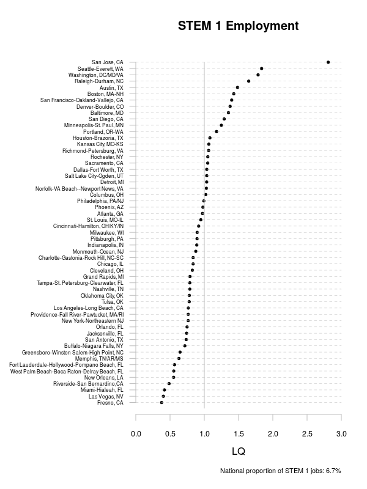
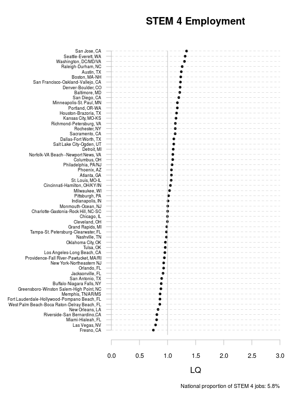
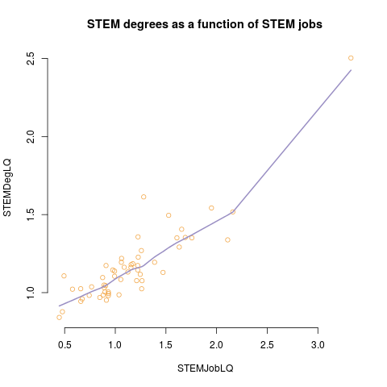
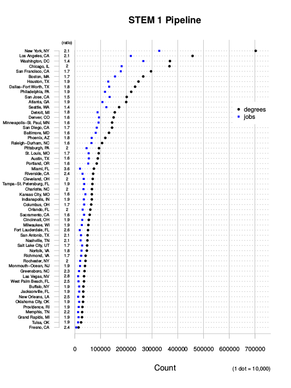
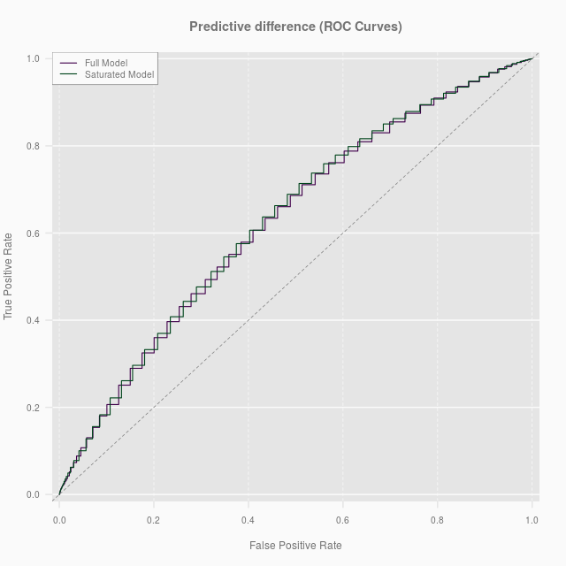

STEM degree holders in STEM jobs: variations by gender, race, and nativity across US metropolitan labor markets

**ABSTRACT**

Jobs in in science, technology, engineering, and mathematics (STEM) are vital for regional and national prosperity. This paper explores the geography of the matching between STEM degree holders and STEM jobs across large metropolitan labor markets in the United States and assesses how gender, race, and nativity are bound up with these patterns. This link between STEM workers and STEM jobs is a crucial section of what has become known as the STEM pipeline--the connection joining STEM training in schools and universities to employment in STEM fields. Pairing new degree field data from the American Community Survey with employment information from the same source brings into view spatial variation in the matching of what many consider critical types of college degrees to a set of occupations deemed central to economic development. We find  … .
Keywords: STEM, labor markets, job matching, agglomeration, gender

# Introduction

The metaphor usually invoked to describe the creation of the workforce involved in science, technology, engineering, and mathematics (STEM) is the pipeline--the connections that link science-related activities from school to university to work. The idea of the STEM pipeline is used to raise concerns that it is leaky and too thin. For example, seepages from the STEM stream occur in middle school, high school, and college, disproportionately affecting certain groups in particular fields (National Science Board 2010, National Science Foundation 2013). Also, not all STEM degree holders secure STEM-type jobs after graduation (National Science Foundation 2008) because they enter non-STEM occupations. Consternation over a STEM worker shortage because of an insufficient supply, poor training in schools and colleges, or that the visa programs such as the H1-B are capped to low reflects the pipeline’s narrowness. In asserting that this particular piece of plumbing needed both widening and fortifying, John Holdren (the President’s senior advisor on science and technology) recently remarked that “we must expand and strengthen [the pipeline] not only to populate the next and subsequent generations of researchers, inventors, and innovators, but also to prepare the tech-savvy workforce that so many of the jobs of the 21st century are going to require, and to educate the science-savvy citizenry we need for our democracy to work” (2013 5).

Everyone concedes that the quality of science and math education in the US can be improved, that the sexism and racism that continues to plague schooling in the US has particular effects on STEM, and that shortages have indeed occurred at certain moments in certain STEM subfields (e.g., after Sputnik or during the so-called dot com bubble). And nobody disputes that the STEM sector is crucial to the prosperity of local, regional, and national economies. Despite their prevalence and even Presidential authority, however, many of these concerns are contested. The problem for critics is that particular instances shortages or dropout rates get expanded to a position of a universal discrepancy between the supply of a trained STEM workforce and the demand for STEM workers (Teitelbuam 2014). If there are significant labor shortages, why are wages relatively stable in most STEM occupations most of the time (e.g., Ellis 2007; Salzman 2007)? Furthermore, why are qualified STEM workers un- / underemployed or possibly displaced by new STEM workers (Hira 2010; Matloff 2013; Kerr and Kerr 2013; Kerr et al. 2014) and why are there about twice as many STEM degree holders produced than STEM jobs each year (Salzman et al. 2013). Thus, the problem is not a broken, inadequate pipe: i.e., a limited supply. The problem is rather one of a limited demand (Hira 2010). The positions could not be more different. 

Running through these disputes is the metaphor itself. “Pipeline” conjures a conduit from a single source to a single outlet. STEM work in the US is a large and varied field, subject to temporal fluctuations (Teitelbaum 2014) and “demarcated by occupation, level of degree, geographic location, industry-specific knowledge, and years of experience” (Hira 2010 951). Sectioning off the metaphor of pipeline, the analysis in this paper centers on a largely unexplored part of the STEM labor market -- geographic location -- that links the spatial variation of STEM degree holders to STEM jobs. We address two, interlocking, questions. Are STEM degree holders more likely to work in STEM jobs in STEM job agglomerations? And to what extent do answers to these questions depend on the characteristics of STEM degree holders, notably their gender, race, and nativity?  

Previous investigations of the geographies of human capital have often just analyzed the geographic variations in the distribution of workers by level of education, such as college degrees. In contrast, we use new degree field data from the American Community Survey to refine these cartographies by examining the type of college-level training workers have received, where they live, and what they do (Abel and Dietz 2012). Our investigation thus plays into some central debates in economic geography on human capital and regional development. Identification of the geography of these (dis)connections is essential to the general understanding of the relationship between human capital and regional development as well as the more specific efforts by policymakers to match the flow of STEM talent with suitable STEM employment. 

# Matching STEM Degrees with STEM Jobs 

National and regional development depends on human capital (e.g., Glaeser 2000; Florida 2002; 2003; Scott 2006; Moretti 2012). In general, additions to human capital lead to increases in individual-level productivity as well as the likelihood of entrepreneurship and innovation. Translated to the regional scale, larger proportions of people with significant endowments of human capital in a place enhance regional productivity, measured by increases in wages and labor force participation (Moretti 2004a, 2004b, Winters 2013). Furthermore, agglomerations of highly skilled people produce localized knowledge spillovers, positive externalities, and significant local multipliers generating additional boosts in regional economic vitality (Scott 2006; Storper and Scott 2009; Moretti 2012; Peri et al. 2013).

Human capital refers to the knowledge and skills that people have acquired through formal education, training, and on-the-job experience. The debate about how to measure effects of human capital on regional development varies and is diversifying (e.g., Scott 2009) but often falls into two general camps. One conventional proxy is educational attainment, usually measured by years of education (e.g., Rauch, 1993; Berry and Glaeser, 2005). A different approach is that human capital acquired in schools, colleges, and universities captures only a portion of an individual’s talent—measures of creativity should account also for accumulated experience, other measures of intelligence, and entrepreneurial abilities. This leads scholars to examine what people do—their occupation. This is one of the cornerstones of Richard Florida’s “creative class” idea (2002) (based on a set of occupations that include science, engineering, arts, culture, entertainment and the knowledge-based professions of management, finance, law, health care, and education). Florida, of course, is not alone in this way of thinking (e.g., Abel and Gabe 2011; Gabe and Abel 2011; Feser 2003; Markusen 2004; Scott 2009).

Instead of arguing the merits of education or occupation or some other metric as the best measure of human capital, the research in this article addresses the geographic contexts where education specialties channel into types of work. The study of matching is not new. Melo and Graham (2014), for example, hypothesized that labor market pooling increases the quality of the matching between employees and employers. (Note: M&G found a positive agglomeration effect on the correlation between employee productivity (measured by wages) and firm productivity (measured by something I don’t understand). I.e. that agglomerated job pools are associated with a match between workers’ wages and firm productivity.). The hypothesis arises from Marshallian spatial logic in which concentrations of economic activity produce labor-market pooling externalities. These agglomerations result in finer divisions of labor, more efficient job searches, and improved matching between workers and firms.  Using employment density per unit of area as a proxy measure for this, they found a positive relationship between labor market pooling and matching.  Larger labor markets also facilitate a more refined matching between types of human capital and occupations. Scott (2009) discovered that jobs that relied on “cognitive human capital” were associated with the US urban hierarchy: i.e., large metropolitan areas were characterized by larger numbers of occupations requiring cognitive human capital relative to smaller metropolitan areas (see also Abel et al. 2014). Workers with such skills were likely to be better matched to jobs in large labor markets.  

This matching relationship exists at even finer dissections of cognitive human capital.   Abel and Deitz (2012) discovered higher rates of matching between workers with specific undergraduate degrees and associated occupations in the largest and the most dense (measured by workers per unit of area) US labor markets.   Our research investigates this matching for workers with STEM degrees.  If the matching of STEM degrees to STEM jobs mirror Abel and Deitz’s findings for all undergraduate degrees, then STEM graduates will be more likely to work in STEM occupations where these jobs are both more numerous and more dense.  For many occupations, the density of jobs per unit of area strongly correlates with the size of metropolitan labor markets. The effects of density and size are woven together in this case.  STEM is different:  large metropolitan areas will generally have more STEM jobs than smaller ones but the largest concentrations of STEM jobs are in a handful of medium to large metropolitan area STEM agglomerations (FIgure 1 below).  The labor market pooling externalities that drive matching should be greater in these agglomerations than in the largest labor markets.   Accordingly, we suspect that the effect of STEM job density will be greater than that of STEM labor market size in matching STEM degree holders to associated occupations.     

Notes: The Location Quotient (LQ) is the local proportion of STEM 1 jobs divided by the national proportion. Since the chart is sorted by the size of the STEM 1 labor market, the five highest concentration (high LQ) cities are a bit harder to identify (in descending order): San Jose (3.33), Seattle (2.16), Washington, DC (2.11), Raleigh-Durham (1.95), Austin (1.76).

That, however, is just one element of our analysis. Degree matching to jobs in STEM not only depends on rank in an urban hierarchy and agglomeration effects but also hinge on worker characteristics known to affect labor market outcomes more broadly. Within STEM, women’s specializations differ from those of men; they are paid significantly less (ceteris paribus); and men are more likely to hold STEM jobs regardless of degree type (Beede et al. 2011a). As girls and women move along the STEM pipeline, their dropout rates exceed those of boys and men, a situation in school and college that persists despite interventions (e.g., Cronin and Rogers 1999; Blickenstaff 2005). Given that women, blacks, and Latinos with STEM degrees less likely to work in STEM fields than men, especially white and Asian men (Beede et al. 2011a, 2011b), we want to know if metropolitan labor markets mediate these effects. 

Studies of gender and racial labor market outcomes across metropolitan areas finds the same axes and hierarchies of inequalities repeated in each place but with significant differences in their strength (McCall 2001). A number of factors explain this variation, including manufacturing job loss and the size of the nonwhite population (e.g., Tienda and Lii 1989; Wilson 1987). For STEM graduates, we suspect certain locations may offer better job outcomes for particular groups. 

Women, for example, may be less able to translate their STEM degree into a suitable job in STEM agglomerations than in places where STEM jobs are less densely clustered.
Although there is no study confirming this speculation as far as we know, Silicon Valley’s reputation suggests it is a place which disproportionately favors men and the foreign born, perhaps because of the competitive nature of the job market and the imbalanced work-life culture of STEM (Raghuram 2007; Florida 2012a, 2012b). These workplace cultures could be a feature of all STEM agglomerations in which case the raced and gendered inequalities in STEM job matching are imbricated within the processes that produce STEM job agglomerations (cf. McDowell). 

The relationship, however, might work in the opposite direction. Places with significant clusters of STEM jobs offer thicker, richer labor markets and are locations that place a premium on talent — and these milieux may be favorable for women. These labor markets will also be dense with the so-called “creatives”, workers whom Richard Florida has argued are more open to difference than others. (This same logic, of course, also applies to racialized minorities--especially blacks and Latinos.) Whichever the direction, the main point is this: studies of STEM have been sensitive to gendered and raced differences nationally (e.g., National Science Foundation 2013) but none have examined how they might be related to the characteristics of metropolitan area labor markets.

STEM agglomerations at the metropolitan scale might also shape patterns of matching by nativity. STEM employers and academic leaders lobby hard to deepen the pool of STEM labor in the US, claiming labor shortages of those trained in STEM fields constrain their ability to innovate, develop, and produce (National Research Council 2007, 2010) or that such shortages force them to offshore work. This has led to pressure on states and the federal government to direct more funding to STEM education in schools and colleges as well as change immigration policy. Employers have initiated high-profile campaigns, with some success, to raise caps on H1B visas to bring in more foreign-trained STEM workers (Lowell 2010). (The H1-B is a temporary work permit issued to professionals in specialty occupations who have the equivalent of a US baccalaureate qualification. H-1B visa holders cannot switch employers unless s/he obtains permanent residency or switches visas.) For example, while the 1990 Immigration Act set the  H-1B visa cap at 65,000, the American Competitiveness and Workforce Improvement Act of 1998 temporarily increased that cap to 115,000 for the 1999 and 2000 fiscal years as did the subsequent American Competitiveness in the Twenty-First Century Act of 2000, which elevated the caps to 195,000 for fiscal years 2001, 2002, and 2003. The STEM sector is volatile and this lends itself to the creation of a contingent workforce (Raghuram 2007). As in some other sectors that have variable demand (e.g., construction), immigrants are often preferred over native-born workers. This volatility is captured to a degree by the fluctuations in the annual caps on H-1B visas.  

It’s also worth noting that although H-1Bs might be the poster child for foreign-born involvement in STEM activities in the US, they are far from being the only such visa: immigrant workers in science and technology are also hired via L visas (intracompany transfers), J visas (exchange scholars), O visas (extraordinary ability in the sciences, arts, education, business, or athletics), Q visas (cultural exchange and training), and Optional Practical Training that can occur after the expiration of an F visa. 

Nationally, STEM matching for foreign-born workers is higher than for the US-born workforce.  This is unsurprising given that many foreign-born workers come via visa channels that link them (and in the case of H-1Bs, bind them) to specific employers.  Metropolitan STEM agglomerations could mediate the chances of this match for the foreign born in several ways. STEM clusters could raise the match probability above the increase we expect for all workers if companies in agglomerations use H-1B and other visa mechanisms for recruitment more frequently than companies elsewhere. Foreign-born STEM-trained workers in places that are not STEM agglomerations might arrive through other means and thus have a weaker linkage, or a lower rate of matching, to STEM employment. In contrast, perhaps variations in the extent of matching of foreign-born STEM-degree holders with STEM jobs are relatively minor: foreign-born STEM-degree holders obtain work where they can and their rate of matching will not depart significantly across metropolitan areas from that found in aggregate data.
 
To summarize, we expect to find significant geographic variation in patterns of matching among STEM degree holders and STEM jobs.  For women, dense STEM labor markets might either create better opportunities for STEM degree holders to find work in STEM fields; or such places might create barriers.  We also expect that places with concentrations of STEM employment will exaggerate the higher rates of matching we find at the national level for the foreign born. Race … Interactions ...

A NYTimes article reported that in 2013 the Senate Judiciary Committee heard testimony that by every estimate available, at least 70 percent of H-1B visas go to men, most of whom are from India and China.

The background section should tail off with a restatement of the questions.

1. What place characteristics affect the probability that a STEM graduate will be working in a STEM job? Specifically (given the descriptives above) are STEM graduates more likely to be matched in larger STEM markets or in high STEM agglomerations? Or is it that they are more likely to be matched in *both* agglomerations *and* large markets.
2. How do demographic characteristics influence matching? We expect women to be more poorly matched than men; foreign born to be better matched than the native born; etc.
3. If there are place and demographic effects, are the demographic differences mitigated or exacerbated by the place effects?

# Data

I will elaborate further, but here are the main points we need to make about the data.

## Source

We use the 2011 ACS microdata files from the IPUMS project at the MPC. While occupational classficiations (as the Occupational Classification Code, OCC) have been collected since the 19th century, we have had limited insight in to the training workers might have for various occupations. And while we have known degree attainment since 1990, the Census first began collecting data on *degree field* in 2008 and has every year since. The ACS 2011 are the three-year aggregated data which provide enough statistical power to estimate counts in geographies with populations of 20,000 or greater ([Census](http://www.census.gov/acs/www/guidance_for_data_users/estimates/)). While we would liked to have used more recent data, the ACS adopted new [OMB metropolitan area delineations in 2012](https://usa.ipums.org/usa-action/variables/MET2013#description_section) whose differences are enough to break continuity with the older data. At the time of this writing, only the 2012 and 2013 data were available, so we opted for more data rather than more recent data.

## Defining STEM 

We define STEM as a characteristic of individual workers according to two separate criteria. First, as has been done in much of the literature, STEM work is defined by a set of occupational classifications whose skills and responsibilities require some use of STEM. In 2010 the Bureau of Labor Statistics made a recommendation to the Office of Management and Budget (OMB) on which Standard Occupational Classification (SOC) codes should be considered as Science, Technology, Engineering, or Math [cite BLS](http://www.bls.gov/soc/Attachment_A_STEM.pdf). Of the 840 unique SOC codes, 184 were included in one of four STEM *domains*. STEM domain 1 includes Life and Physical Sciences, Engineering, Mathematics, and Information Technology and is what one typically associates with STEM. STEM domain 2 is Social Sciences; domain 3 is Architecture; and domain 4 is Health and Health Services. 

### Standard Occupational Classification

The Standard Occupational Classification (SOC) is a taxonomy of jobs broken heirarchically into twenty-three major and ninety-seven minor groups. Contained within those groups are 461 broad occupations that are further broken down into 840 detailed occupations. We can see in the example below the first two digits (15) denote the major group while more granular detail moves toward the right in the latter four digits. 

Group                       Example
-------                     ----------
23 major groups             15-0000, Computer and Mathematical Occupations
97 minor groups             15-2000, Mathematical Science Occupations
461 broad occupations       15-2040, Statisticians
840 detailed occupations    15-2041, Statisticians

### STEM domains

The BLS taxonomy breaks the 184 STEM detailed occupational categories into one of four STEM *Domains* as described below with examples of detailed occupations given for each. 

-------------------------------------------------------------------------------
Domain  Name                             Count  Examples
------- -------                         ------  ----------
1       Life and Physical Sciences,         97  (15-1131) Computer Programmers
        Engineering, Mathematics,               (17-2000) Engineers
        and IT                                  

2       Social Sciences                     20  (19-3011) Economists

3       Architects                          3   (17-1010) Architects

4       Health Occupations                  64  (29-1067) Surgeons
                                                (29-2021) Dental Hygienists
-------------------------------------------------------------------------------

The BLS classification further imposes a scheme of similar job types across the four domains in a matrix format. There are five sub-domains that further subdivide the *type* of work done in each of the major domains above. 

Sub-domain      Name
-----------     -----------------------
A               Research, Development, Design, or Practitioner Occupations
B               Technologist and Technician Occupations
C               Postsecondary Teaching Occupations
D               Managerial Occupations
E               Sales Occupations

The Standard Occupational Classification is described in the IPUMS ACS data by the harmonized Standard Occupational Classification (variable: OCCSOC).  We have classified each of the 840 OCCSOC codes as either non-STEM or one of the four major STEM domains by imposing the BLS schema over it. To allow for the possibility of career mobility (management), the specialist training required in some technical sales occupations, and for the potential career mobility of persons working in STEM (postsecondary teaching), we included *all* subdomains in our definition of STEM. 

In the 55 largest cities, STEM jobs account for 13% of the labor force, with about 6.7% in STEM (domain) 1 jobs and about 5.8% in STEM (domain) 4. 

### STEM Degrees

If human capital is the bundle of sticks that is knowledge and skills acquired through formal education, training, and on-the-job experience, then past use of occupational classification as a proxy for human capital has been one-dimensional. New questions in the American Community Survey now enable us to discern not only the job one is doing, but as a closer proxy for human capital, the educational qualification for a job. As we have mentioned throughout, this study takes advantage of a more detailed description of higher educational attainment beginning with the 2008 ACS. We now have 39 distinct codes classifying the first and second major fields of study for holders of a four year degree.

Of the 39 distinct degree fields reported in the IPUMS variables DEGFIELD and DEGFIELD2 (which denotes a second degree if available), we coded seven as STEM.

Table: STEM Degree fields and their proportions:

DEGFIELD    Description                                                    Proportion
---------   -----------------------------------------------------------  ------------
24          Engineering                                                   		0.394
21          Computer and Information Sciences                             		0.199
36          Biology and Life Sciences                                     		0.149
50          Physical Sciences                                             		0.134
37          Mathematics and Statistics                                    		0.058
25          Engineering Technologies                                      		0.053
51          Nuclear, Industrial Radiology, and Biological Technologies    		0.002

Engineering are the largest proportion of STEM degree holders, followed by Life Sciences, Computer Sciences, and Physical Sciences which together comprise almost 90% of STEM degree holders. 

## STEM Descriptives

Restricting the ACS data to those in the labor force (EMPTSAT = 2 or 3) and to persons between the ages of 25 and 65 (is below for everyone or just the largest cities?) we can take a first look at cross-tabulations of workers by job and degree type.

Table: Proportion of the workforce by STEM degree/domain:

          			 0       1       2       3       4
--------------  ------  ------  ------  ------  ------
No Degree     	 0.624   0.018   0.000   0.000   0.026
non-STEM     	 0.218   0.012   0.002   0.001   0.025
STEM degree      0.036   0.027   0.000   0.000   0.009

The largest proportion of workers are in non-STEM jobs, and the largest proportion of those lack a four year degree (Table below). By these numbers just under 38% of the workforce between the ages of 25 and 65 in the 55 largest cities have a Baccalaureate degree, and about 8.7% hold a degree in a STEM field (about 23% of all degree holders). Non-STEM degree holders in non-STEM jobs outnumber their STEM working counterparts by over five to one. Perhaps surprisingly, the number of STEM degree holders is fairly evenly divided between STEM and non-STEM jobs. (Note: the zeroes for non degree holders in STEM domains 2 and 3 are a result of rounding error and were preserved for table formatting. the numbers are 0.015% and 0.017%, representing an estimated 10,500 and 11,900 persons respectively.) 

One of the dimensions of interest regarding STEM education and STEM employment is that STEM job holders and STEM degree holders typically command greater earnings in the labor market. As we can see below, the effect of STEM jobs and STEM degrees on income is clearly complimentary. STEM job holders in every domain earn more than non-STEM job holders irrespective of education. At the same time STEM degree holders earn more than their non-STEM degree holding counterparts in every domain. Even in non-STEM jobs they earn almost 22% more than non-STEM degree holders. When divided this way we also see the stunning income inequality for the largest segment of the workforce, non-STEM workers without a college degree whose mean total income is just beyond twice the poverty level for a two person family in 2011 [cite HHS](http://aspe.hhs.gov/poverty/11poverty.shtml).

NEW TABLE:

          0       1       2       3        4
---  ------  ------  ------  ------  -------
0     33346   58980   54836   59235    44817
1     65798   76253   72943   73087    78407
2     81407   89152   86242   84602   140345

Table: mean income by STEM degree/domain

            0       1       2       3        4
---------- ------  ------  ------  ------  -------
No degree   34416   62093   58486   58011    47381
non-STEM    71359   80006   76988   74403    80982
STEM degree 86835   92451   94260   90121   140456

Graduate education has some influence on income. For example, much of the effect in STEM domain 4 for STEM degree holders is medical doctors. If we eliminate persons with post-graduate degrees, STEM degree holders maintain their income advantage in every domain *except* STEM domain 4. This shift likely has to do with the relatively higher pay for some high-level finance and administrative jobs which STEM degree holders might be less likely to hold.

             0       1       2       3       4
----------- ------  ------  ------  ------  ------
non-STEM     63407   75853   71417   72180   65057
STEM degree  72847   86409   78489   92060   59909

The two previous tables include the weighted average total personal income (IPUMS: INCTOT) from the 2011 3-year ACS. It is important to note that DEGFIELD is coded only for undergraduate fields of study. We therefore do not know whether graduate degree fields are STEM and thus our ability to match training to work becomes more difficult. While it is perhaps rare that someone with a non-STEM undergraduate degree would complete a STEM graduate degree, we expect that it is not rare in reverse. For example, an engineer might complete an MBA and work in finance, or someone with a science undegraduate degree might go to law school. Because graduate education is often a springboard for different career directions, and because we lack data on graduate degree fields, we must exclude them from the analysis of how STEM education is realized into the STEM labor market.

## The Geography of STEM

Add proportion for college grads only

(These numbers seem wrong!) In the 55 largest cities, STEM (domain) 1 accounts for 51.6% of all STEM employment; it most closely captures the occupations associated with science and engineering. Employment numbers in the social sciences and architecture domains are negligible: 2.3% and 1.3% of total STEM employment respectively. The other major STEM domain, health practitioners and managers, has 44.8% of STEM employment. Jobs in this sector serve the demand for health services and locate in local and regional medical centers rather than cluster in specific metropolitan areas where key growth industries agglomerate. STEM 4 occupations follow a spatial logic that differs from the majority of STEM 1 jobs. The former follows Christallian principles; the latter, Marshallian. Indeed, the distribution of persons employed in STEM 1 and STEM 4 jobs in these 55 metropolitan areas is different.  The counts of STEM 4 jobs, correlate with metro population (r= 0.98). Location quotients range from 0.74 to 1.35 with a standard deviation of 0.15. In contrast STEM 1 employment has a geography more loosely associated with the underlying population size (r=0.90). Metropolitan location quotients range from 0.38 to 2.81 with a standard deviation of 0.41. As the distribution of STEM 4 jobs is mostly a function of population, our analysis focuses on the more distinctive geography of STEM 1, the occupations that, in many instances, drive local and regional economies.  References to “STEM” in the sections that follow indicate the 97 occupations grouped into STEM 1.

Integrate the two following charts into the text.

Some discussion of how/why we limited our analysis to the 55 largest cities.

# Descriptives

We limit our analysis to civilian individuals between the ages of 25 and 65 (inclusive) who live in households, identified as in the labor market (both employed and unemployed), and with a STEM degree.

This would be a good place for a table of proportions (perhaps?) across categories.

We probably need a chart of cities ordered by STEM Job LQ.

## STEM Degrees

Nationally, degree holders number 42.3M (33%) in the labor force between the ages of 25 and 65, of which about 9.2M or 22% are in STEM fields. Just looking at the largest 55 cities, we have about 26.6M degree holders out of 70.4M persons in the labor force or 37.7%. Of those 26.6M degree holders 6.2M or just under 23% have STEM degrees. 

We limit to persons with a Bachelor's degree only. We exclude graduate degrees because we do not know what proportion have remained in STEM. I.e. the path from non-STEM to STEM through graduate training is thin --hard to get an MS in Engineering, CS, etc. if you haven't had undergrad calc/diff eq. But many STEM undergrads go to Law School, B School, etc. It's troubling because advanced degree attainment among STEM degree holders is astounding. 46% of STEM degree holders go on to get a graduate/professional degree of some kind as compared with 35% of non STEM degree holders.

Across the 55 largest cities:

                      mean (sd)       min       25%    median        75%        max
-----------  ------------------  --------  --------  --------  ---------  ---------
Count         112,000 (119,000)    14,100    39,400    64,400    140,000    657,000
proportion       0.222  (0.047)     0.160     0.194     0.214      0.232      0.475
LQ               1.170  (0.250)     0.841     1.020     1.130      1.220      2.500

Note: That is shocking given the employment prospects for non-STEM degree holders. It suggests that perhaps STEM is a filter for talent --higher performing people in the labor market go in to STEM. Which I say in the presence of some very smart, high-performing, and high-potential Harvard Law Students, none of whom have STEM degrees. Digression over.

How does that affect matching percentage? Perhaps because STEM degree holders are a relatively small proportion of degree holders in the labor force, the big difference in graduate attainment does not have a large overall effect on matching if we eliminate them. That's a really cumbersome sentence. Overall matching probability among those with bachelors degrees only is 40.9% as compared with 38.5% when we include those with graduate degrees. Put that in your pipe and smoke it. 

## STEM Employment

In the national labor market, STEM comprises just over 12% of employment split almost evenly between STEM 1 and STEM 4 (5.7% and 6.1%). Those proportions remain stable in our subset of cities, but STEM 1 makes a minor gain in share (6.7% and 5.8%, for STEM 1 and STEM 4 respectively). As discussed earlier, the variation in STEM 1 is much wider across cities than is STEM 4 ($\sigma = 0.48$ and $\sigma = 0.14$). The variation in STEM 1, however, is driven by some extreme values. The interquartile range for the LQ is 0.9 to 1.26. 

          		      mean (sd)       min       25%     median        75%       max
------------  -----------------  --------  --------  ---------  ---------  --------
Count     		86,800 (82,200)     9,860    30,800     51,000    121,000   401,000
Proportion		0.0659 (0.0275)    0.0254    0.0508     0.0603     0.0716     0.189
LQ        		1.1600 (0.4840)    0.4470    0.8950     1.0600     1.2600     3.330

Cities with the highest LQs. I don't remember why I wanted this...

                          STEM Job        LQ                        STEM Degrees      LQ
----------------------------------  --------  ----------------------------------  ------
San Jose, CA                            3.33  San Jose, CA                          2.50
Seattle-Everett, WA                     2.16  Houston-Brazoria, TX                  1.61
Washington, DC/MD/VA                    2.11  Raleigh-Durham, NC                    1.54
Raleigh-Durham, NC                      1.95  Seattle-Everett, WA                   1.52
Austin, TX                              1.76  San Diego, CA                         1.50
Boston, MA-NH                           1.69  San Francisco-Oakland-Vallejo, CA     1.41
San Francisco-Oakland-Vallejo, CA       1.66  Detroit, MI                           1.36
Denver-Boulder, CO                      1.63  Boston, MA-NH                         1.35
Baltimore, MD                           1.61  Baltimore, MD                         1.35
San Diego, CA                           1.53  Austin, TX                            1.35

There is a strong linear relationship between the concentrations of STEM jobs and degrees

\

# Method

We will answer the questions above by modeling the probability of a match as a function of place characteristics (both the size and the relative concentration of the STEM job market) and individual demographic characteristics (age, race, sex, and nativity).

$$P[match] = \beta_0 + \beta_x X + \beta_j J + \epsilon$$

$$Pois(\lambda = \mu)$$

Insert paragraph about how we estimated relative risks directly vs. logit.

Where $X$ is a matrix of individual characteristics for all individuals $i$ and $J$ is a matrix of place characteristics for all places $j$. Our outcome variable is a binary variable that is true if an individual has both a STEM degree and works in a STEM (domain 1) job.

We will present the relative risk of a match to the reference category of a native born, white male. Age is centered at the mean for this subset (about 42.75 I think). I don't know how much we want to discuss that we estimated the relative risk directly as a poisson-distributed binary outcome versus a logit.

This is the relative risk estimated directly. So interpret the coefficient as the multiplicative difference in the probability of a match. 

We tried different modeling strategies and they all yielded similar results. 

Also mention that this is only 4 year degree holders --we eliminate advance degree holders. Cite Abel and Deitz on why. Also need to compare results with the model of advanced degree holders also.

# Results

I will go through each question in a subsection

## Main effects

As a baseline for the subsequent models, we first estimate just the main effects of race, sex, nativity and age on the outcome of a match probability. Age has been centered at the mean of 42.8 years. We add a quadratic term for age to account for possible slowdowns in the rate of change in STEM matching 
    

|                   | Estimate| robust.se|   lcl|   ucl|
|:------------------|--------:|---------:|-----:|-----:|
|(Intercept)        |    0.494|     0.003| 0.487| 0.500|
|Hispanic           |    0.722|     0.014| 0.695| 0.749|
|Black              |    0.795|     0.015| 0.766| 0.824|
|Asian              |    1.214|     0.015| 1.186| 1.244|
|Women              |    0.616|     0.007| 0.604| 0.629|
|Foreign Born       |    0.893|     0.010| 0.873| 0.913|
|age (centered)     |    0.988|     0.000| 0.987| 0.989|
|$\mathrm{age}^2$   |    1.000|     0.000| 1.000| 1.000|

## Size or concentration of the STEM job market?

Our first question is whether the probability of a match is driven by agglomeration or the size of the STEM job market. We expect that the largest labor markets, despite a smaller relative share of STEM jobs, would have the largest number of STEM jobs overall. Figure (below). The question, then is do STEM graduates have a better probability of working in STEM jobs in STEM job clusters (San Jose, Seattle, Raleigh-Durham) or in the largest STEM employment markets (New York, Washington DC, Los Angeles)?

A few things to point out about this chart. It is sorted by the size of the labor market. The y-axis is annotated with the ratio of STEM degree holders to STEM job holders. 

1. The largest labor markets have the largest number of STEM jobs.
2. There is a close correlation between the number of STEM jobs and STEM degree holdes.
3. But in almost every city there is a severe *excess* of STEM degree holders relative to STEM jobs.

Given that in the largest employment markets there are roughly double the number of STEM qualified graduates than the number of jobs, we expect matching probabilities to be far less than 1.

To answer this question we compare models with measures for the STEM job count (centered at the mean of ~177,000) and the STEM job location quotient (centered at 1). The location quotient (LQ) is a ratio of a local proportion to a reference (national in this case) proportion. We divide the local proportion of STEM jobs (among *all workers*) by the national proportion of STEM jobs to calculate the local concentration of STEM employment. This measure has the advantage of being very easy to interpret. An LQ of 2 means that a the local proportion of STEM jobs is twice that of the national proportion. Cite additional sources that have used the LQ as a measure of agglomeration/concentration.

We estimate a reference model with no place variables, then one each with LQ (model 2), and count (model 3), and finally a model with both measures (model 4). 

|              |       base|      count|         lq|       both|
|:-------------|----------:|----------:|----------:|----------:|
|(Intercept)   |      0.494|      0.490|      0.482|      0.478|
|Hispanic      |      0.722|      0.723|      0.742|      0.744|
|Black         |      0.795|      0.800|      0.800|      0.806|
|Asian         |      1.214|      1.228|      1.182|      1.196|
|Women         |      0.616|      0.617|      0.617|      0.617|
|Foreign Born  |      0.893|      0.902|      0.896|      0.906|
|age centered  |      0.988|      0.988|      0.988|      0.988|
|$\mathrm{age}^2$       |      1.000|      1.000|      1.000|      1.000|
|STEM job count|         NA|      1.000|         NA|      1.000|
|STEM job LQ   |         NA|         NA|      1.227|      1.229|
|Log Likelihood|     -70982|     -70960|     -70798|     -70772|
|Pr[>Chi]      |         NA|      0.000|      0.000|      0.000|
|BIC           |     142067|     142034|     141711|     141669|

As expected, given the chart above, the baseline match probability (for a white, native born man of average age in a city with a STEM job concentration equal to the national proportion of stem jobs) is just under one half. 

I suppose I should include the standard errors, but with this much data, the t-tests for all coefficients are highly significant. The smallest t statistic we calculate is on the order of 6 or 7. Given the large number of observations, coefficients are going to be well estimated and therefore statistically significant even if effects are small as we can see in the case of the coefficient for the STEM job count in model 4. 

A more conservative approach is to use the likelihood ratio and information critera to compare models with the various factors. We expect the log likelihood to be higher (closer to zero in this case) in a better fitting model. Of course, additional parameters will usually have a positive influence on model fit, so we must take that into account when comparing. The likelihood ratio test (which compares the difference in double the log likelihood plus the number of parameters has a $\chi^2$ distribution whose degrees of freedom match the number of additional parameters (cite). The Bayesian Information Criterion is a version of the likelihood ratio test that imposes an additional penalty for large datasets by multiplying the number of parameters by the log of the number of observations (formula below).

$$BIC = -2 \mathcal{L} + k ln(n)$$

A lower BIC provides evidence for a better fitting model. The guideline (cite Raftery) is that a BIC -2 provides evidence for a better fit, and a BIC of -10 (or more) provides very strong evidnce for better fit.

By this measure the best fitting model is the one with both job count and agglomeration (LQ). Because the *effect* for job count is effectively 1, the evidence suggests that matching probabilities are driven by agglomeration.

So, model fit suggests that it is STEM job concentration that has a large and positive influence on the probability of a STEM degree holder working in a STEM job.

## Demographic effects

Unsurprisingly, women, and historical minorities have poorer matching probabilities than native born, white men. Asian men are the only group to show an advantage in matching probability.

We will test whether nativity modifies

|            | Estimate| robust.se|   lcl|   ucl|
|:-----------|--------:|---------:|-----:|-----:|
|(Intercept) |    0.494|     0.003| 0.487| 0.500|
|f_raceH     |    0.722|     0.014| 0.695| 0.749|
|f_raceB     |    0.795|     0.015| 0.766| 0.824|
|f_raceA     |    1.214|     0.015| 1.186| 1.244|
|f_sexF      |    0.616|     0.007| 0.604| 0.629|
|f_fbfb      |    0.893|     0.010| 0.873| 0.913|
|agec        |    0.988|     0.000| 0.987| 0.989|
|I(agec^2)   |    1.000|     0.000| 1.000| 1.000|

(These are the same as Model 1 above, now shown with standard errors and confidence intervals. The above table is given just to show a baseline.)

One surprising finding is that the effect for the foreign born is negative: that the foreign born with STEM degrees are less likely to be matched in STEM jobs. These data do include unemployed persons, so it is conceivable that barriers (language, etc.) might attenuate their ability to realize their training into employment. But given the number of H1-B visa holders we expect that the effect might be different based on race: a foreign born Chinese STEM graduate might have a better matching probability than a South American or African STEM graduate. 

We expect, however, that the effects of race might be modified by nativity.Given the relatively large number of H1-B visa holders who are from South and East Asia, the match probability might be very different for native and foreign born Asians. Obversely, we might expect that foreign born Hispanics and Blacks might suffer from structural discrimination that makes it more difficult to realize their training into employment.

We will evaluate another model (this time without the place effects) with an additional factor to test for whether nativity modifies the effect of race in the model above.

|               | Estimate| robust.se|   lcl|   ucl|
|:--------------|--------:|---------:|-----:|-----:|
|(Intercept)    |    0.478|     0.003| 0.472| 0.484|
|f_sexF         |    0.616|     0.007| 0.603| 0.629|
|f_raceH        |    0.875|     0.019| 0.838| 0.914|
|f_raceB        |    0.822|     0.017| 0.790| 0.856|
|f_raceA        |    1.033|     0.020| 0.994| 1.074|
|f_fbfb         |    0.905|     0.015| 0.876| 0.935|
|agec           |    0.988|     0.000| 0.988| 0.989|
|I(agec^2)      |    1.000|     0.000| 1.000| 1.000|
|stemjoblqc     |    1.228|     0.009| 1.211| 1.245|
|stemjobcountc  |    1.000|     0.000| 1.000| 1.000|
|f_raceH:f_fbfb |    0.699|     0.028| 0.647| 0.756|
|f_raceB:f_fbfb |    0.916|     0.043| 0.835| 1.004|
|f_raceA:f_fbfb |    1.198|     0.031| 1.138| 1.261|

All the advantage that Asian men have appears to be restricted to *foreign born* Asian men. Once we test for the effect modification, we see that the coefficient for Asian men can no longer be estimated as above or below 1. But the interaction term for foreign born Asian men seems to have absorbed most of the effect seen in the first model. In addition, we see some evidence for a disadvantage for Hispanic men. The interaction between nativity and race further diminishes an already disadvantaged match probability for Hispanics overall. The factor for black men cannot be estimated well enough to say whether nativity has any effect.

## Does place influence matching probability

Thus far we know that there is a strong place effect and that while we have evidence that both the size and concentration of the STEM job market have a positive effect on match probability, it is only concentration that has a measurably positive effect. We also know that most population groups are *disadvantaged* in their ability to realize STEM training in to STEM jobs relative to white, native born men. Our last question is whether different labor markets mitigate or exacerbate those effects. To answer that question we evaluate models that test whether the concentration measure (LQ) modifies the demographic effects. If the interaction terms between LQ and demographic categories are non-zero and significant, then we have evidence that the demographic effects depend, in part, on the relative concentration of the STEM labor market. Furthermore if the models of effect modification fit better than those without then we have strong evidence that place modifies the demographic effect on match probability.

$$P[match] = \beta_0 + \beta_x X + \delta_{jx} J \times X + \epsilon$$

Where $X$ is a matrix of individual-level characteristics as in previous models and $J$ is a the Location Quotient (LQ) of the local concentration of STEM jobs.

We test three separate models, one each for sex, nativity, and race, followed by a full model that includes all three.

                     base            lq:sex          lq:nativity     lq:race         full          
-------------------  --------------  --------------  --------------  --------------  --------------
(Intercept)          0.478 (0.003)   0.479 (0.003)   0.478 (0.003)   0.477 (0.003)   0.478 (0.003) 
stemjoblqc           1.237 (0.009)   1.224 (0.009)   1.238 (0.012)   1.252 (0.013)   1.231 (0.013) 
stemjobcountc        1.000 (0.000)   1.000 (0.000)   1.000 (0.000)   1.000 (0.000)   1.000 (0.000) 
f_sexF               0.617 (0.007)   0.612 (0.007)   0.617 (0.007)   0.617 (0.007)   0.612 (0.007) 
f_raceH              0.744 (0.014)   0.744 (0.014)   0.744 (0.014)   0.746 (0.014)   0.749 (0.014) 
f_raceB              0.806 (0.015)   0.806 (0.015)   0.806 (0.015)   0.799 (0.015)   0.801 (0.015) 
f_raceA              1.195 (0.015)   1.195 (0.015)   1.195 (0.015)   1.210 (0.015)   1.217 (0.016) 
f_fbfb               0.907 (0.010)   0.906 (0.010)   0.907 (0.011)   0.908 (0.010)   0.901 (0.011) 
agec                 0.988 (0.000)   0.988 (0.000)   0.988 (0.000)   0.988 (0.000)   0.988 (0.000) 
I(agec^2)            1.000 (0.000)   1.000 (0.000)   1.000 (0.000)   1.000 (0.000)   1.000 (0.000) 
stemjoblqc:f_sexF    NA              1.061 (0.021)   NA              NA              1.062 (0.021) 
stemjoblqc:f_fbfb    NA              NA              1.000 (0.014)   NA              1.050 (0.020) 
stemjoblqc:f_raceH   NA              NA              NA              1.108 (0.038)   1.083 (0.038) 
stemjoblqc:f_raceB   NA              NA              NA              1.106 (0.049)   1.091 (0.049) 
stemjoblqc:f_raceA   NA              NA              NA              0.948 (0.014)   0.915 (0.018) 
Pr[>Chi]             NA              0.026           0.986           0.001           0             
Log Likelihood       -70767.759      -70765.288      -70767.758      -70759.201      -70755.109    
BIC                  141661.319      141667.814      141672.756      141678.515      141693.203    

Here our results are somewhat mixed. Overall there is not strong evidence that STEM job concentration improves the condition for any demographic group over any other. The match probabilities do increase with STEM job concentration (model 1 way back), but they do not confer an advantage on any group. 

If we look first at whether the interaction terms between place and demographic variables are statistically significant we get mixed, weak support for place having some effect. For women (the second column of table [ref]) we get a t-statistic of ($0.058 / 0.02 = 2.9$) which is statistically significant down to 2 degrees of freedom. The log likelihood of this model is marginally higher than the base model and the $\chi^2$ probability for the difference in log-likelihood is small enough (0.03) that we have evidence for a better fitting model. If, however, we assess the difference in model fit using the more conservative, information criterion approach then it appears the difference in model fit does not carry the weight incurred by the extra parameters and the large sample sizes. Or, said more clearly, the cost of the extra parameters and large sample size overwhelm the very small differences in model fit. 

By these standards, there is weak evidence that place modifies the effect for women, blacks, and the foreign born. But the best fitting model overall after taking the cost of extra parameters into account is the base model. For that reason we do not have evidence to suggest that place modifies the effect of race, sex, or nativity on the probability of a match.

The import of this is meaningful. While women, racial minorities, and the foreign born have better probabilities of matching in cities with high concentrations of STEM jobs, the advantages there are the same as for white, native born men. So the advantage obtains from the labor market rather than any differential effect of labor markets on different population subgroups.  

This raises two questions which I am not sure we want to answer.

1. Have we missed any other important interactions?
2. Because San Jose has such a higher concentration of STEM Job and Degree holders, is it exerting a disproportionate influence? In other words, are we seeing a San Jose effect?

With regard to the first, we can estimate a fully saturated model in which each factor interacts with every other. 

### Fully saturated model

Below is an analysis of deviance table for a fully interacting model with match probability as the outcome. The analysis of deviance is similar to an analysis of the residual sum of squares (ANOVA) from a linear model with a continuous outcome. Because the effects are non-orthogonal (i.e. collinear) we cannot treat the estimated deviance for each factor as a statement of the proportion of the overall variance explained. It is, however, useful to understand which factors do the most work in differentiating the outcome from the others.

                                Df   Deviance   Resid. Df   Resid. Dev
-----------------------------  ---  ---------  ----------  -----------
NULL                            NA         NA       92646     67604.40
stemjobcountc                    1      37.19       92645     67567.21
agec                             1     505.84       92644     67061.37
I(agec^2)                        1      42.65       92643     67018.72
stemjoblqc                       1     521.92       92642     66496.80
f_sex                            1    1544.12       92641     64952.68
f_fb                             1       4.89       92640     64947.80
f_race                           3     512.28       92637     64435.52
stemjoblqc:f_sex                 1       4.94       92636     64430.58
stemjoblqc:f_fb                  1       0.01       92635     64430.56
f_sex:f_fb                       1      60.09       92634     64370.47
stemjoblqc:f_race                3      21.28       92631     64349.19
f_sex:f_race                     3      20.24       92628     64328.95
f_fb:f_race                      3     102.67       92625     64226.27
stemjoblqc:f_sex:f_fb            1       2.45       92624     64223.83
stemjoblqc:f_sex:f_race          3       0.71       92621     64223.12
stemjoblqc:f_fb:f_race           3       4.24       92618     64218.88
f_sex:f_fb:f_race                3       2.91       92615     64215.96
stemjoblqc:f_sex:f_fb:f_race     3       0.91       92612     64215.06

Sex (gender) does three times the work that any of the next nearest factors: Age, STEM job agglomeration (LQ), and race. As we saw in the sections above, the interactions between place and sex/nativity/race do very litte work in the model. Two additional factors that we did not consider are the interactions between race and nativity and between sex and nativity. Dunno if we want to go here. The big part of the story is that agglomeration does as much work in the model as age and race. And that sex is far and away the most important factor in differentiating the probability of a match. 

If we compare predictive performance between our full model and the fully saturated model, the difference is negligible. 

\

The Receiver Operating Characteristics (ROC) curve helps us visualize the predictive performance of our models. By plotting the true positive prediction/classification rate (matched or not) as a function of the false positive rate, we can see whether our model does much better than random guessing (the grey line $y = x$). Neither of our models predict a match very well. But the point of this graph is to see that even the fully saturated model, while offering a marginally better fit, ultimately has very little more explanatory power.

In short, nothing about it weakens our conclusions, nor distracts from them. 

### Do you know the way to San Jose?

I need to re-estimate this without the race-nativity interaction. But model fit improves vastly once we remove San Jose, but the coefficients remain very stable. So, the effects are the same either way. Not a big story (IMHO). 

|mod.isj.names      |w/o San Jose  |All Cities    |
|:------------------|:-------------|:-------------|
|(Intercept)        |0.477 (0.003) |0.478 (0.003) |
|stemjoblqc         |1.296 (0.019) |1.239 (0.013) |
|stemjobcountc      |1.000 (0.000) |1.000 (0.000) |
|f_sexF             |0.610 (0.007) |0.611 (0.007) |
|f_raceH            |0.880 (0.020) |0.875 (0.019) |
|f_raceB            |0.819 (0.017) |0.816 (0.017) |
|f_raceA            |1.054 (0.022) |1.050 (0.022) |
|f_fbfb             |0.909 (0.016) |0.905 (0.015) |
|agec               |0.988 (0.000) |0.988 (0.000) |
|I(agec^2)          |1.000 (0.000) |1.000 (0.000) |
|f_raceH:f_fbfb     |0.711 (0.029) |0.705 (0.028) |
|f_raceB:f_fbfb     |0.910 (0.043) |0.918 (0.043) |
|f_raceA:f_fbfb     |1.188 (0.033) |1.193 (0.032) |
|stemjoblqc:f_sexF  |1.108 (0.033) |1.060 (0.021) |
|stemjoblqc:f_fbfb  |1.025 (0.033) |1.006 (0.020) |
|stemjoblqc:f_raceH |1.076 (0.054) |1.063 (0.037) |
|stemjoblqc:f_raceB |1.054 (0.051) |1.096 (0.049) |
|stemjoblqc:f_raceA |1.004 (0.035) |0.943 (0.019) |

Wow, so the model fit without San Jose is just immesurably better. For the most part the coefficients remain stable with a few notable differences. First, the Asian advantage we measured before remains only for foreign born --just like in the model with all cities. But where before we could say that there was a measurable (if small) disadvantage for all Asian men in high STEM job LQ cities, that disadvantage evaporates (or at least we no longer have evidence to support it) once San Jose is eliminated. This suggests that the San Jose effect is negative for Asian men. That is unexpected. Also, the effect modifier for women in high STEM job LQ cities, which was statistically significantly positive before, has a slightly higher magnitude *without* San Jose. 

The advantage for Blacks attenuates once we remove San Jose, and the advantage for Hispanics increases slightly but so does our measurement error. In neither case do we have enough data to estimate a result greater than zero. 

The right way to do this would be to run through the entire analysis again without San Jose to see if our interactions make for a better model fit --remember that they did not in the model with all 55 cities. 

But I will not do that for a couple of reasons. 1. while it hints at some interesting San Jose effects, they are small. In other words, the slight differences we see for women and Asian men is, I think, less of a story than the relative stability of the coefficients. 2. it draws attention to how sensitive these models are to geographic boundary-making. I imagine we would see all kinds of small, interesting changes as we broadened the scope to more cities, dropped selected cities, combined some into larger labor markets (a prime candidate is San Francisco/San Jose), etc.  In other words, we know that there are some unique effects in different places, but this takes us down a rabbit hole that is best left for another paper: given these results, are there cities in which women, Blacks, Hispanics, Asians, Foreign Born, etc. have better/worse outcomes. That is more of a mapping paper and would be interesting. IMHO there is no way to avoid a fully saturated, fully interacting model. I'll try to estimate that, but I think my computer will explode if I do. 

# Conclusion

Remembering that we started this discussion with the pipeline metaphor we have provided a snapshot of one of the very last phases of the STEM pipeline. And taking this broad, macro view Census data show that the inequalities with regard to race and gender are indeed quite sharp in the STEM employment market. Our view has yielded some insight on two surprising dimensions, however. First, is that the number of STEM graduates far exceeds the number of STEM jobs in almost all labor markets. In Washington, DC and Seattle where the gap is narrowest, there are 1.4 STEM graduates for every STEM job. While we do not doubt that some of the largest tech employers are having difficulty finding skilled application developers in certain markets, we cannot mistake the particular for the general. And while our classification of STEM graduates is coarse (e.g. mixing Biology graduates in with software engineering jobs in the same market), we should view the STEM labor market Cassandras with some skepticism. There are far more educated persons with foundational technological and scientific skills in the labor market than there are jobs that require them. 

The second dimension that our analysis has shed some light upon is whether high STEM labor markets attenuate the systemic race and gender disadvantage in the national labor market. If Richard Florida has led us to believe that wonderful economic things will happen when you combine creatives and professionals in cities with high amenities, then we often discursively wrap up the idea that creative cities (which overlap with many of the STEM job agglomerations) and their attendant progressive, meritocratic cultures will play by a different set of rules when it comes to race and gender. This analysis has shown emphatically that they do not. Women and racialized minority STEM graduates are indeed better matched in STEM clusters, but so is everyone else. That STEM agglomeration does nothing to differentially improve the matching prospects for women and racialized minorities suggests that the solution to those labor market inequalities will not be mediated by an invisible hand. 

words, words, words...

This document has 5,700 of them including all the tables.
